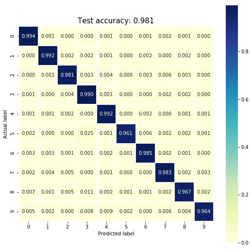
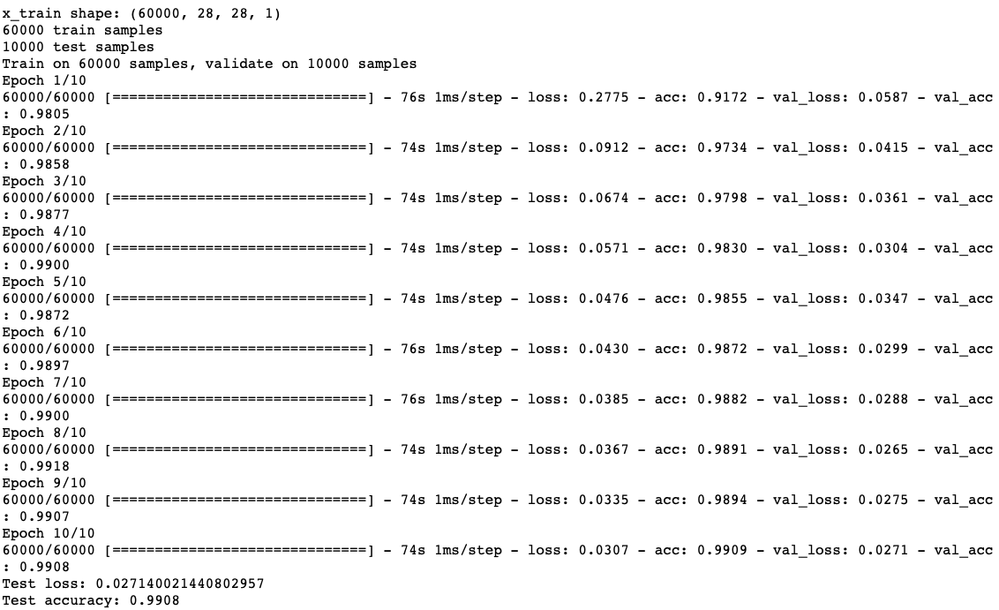

# MNIST Machine Learning

- Focusing on the famous machine learning dataset MNIST handwritten digits
- Using sklearn, tensorFlow, and keras for modeling and predicting this dataset

## Logistic Regression with 92.02% accuracy

## Random Forest with 97.22% accuracy

## Support Vector Classifier with 97.87% accuracy

## Multi-Layer Perceptron with 98.13% accuracy

## TensorFlow Deep Neural Network with 98.34% accuracy

## Keras 2D-Convolutional Neural Network with 99.08% accuracy

